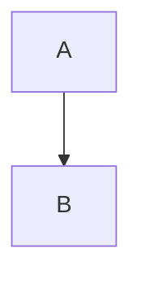

# Guide

## Uso

Volver al [inicio](../index.md), la [otra](./otra.md#paso) y el [changelog](../../CHANGELOG.md#v1).

```mermaid
graph TD; A-->B;
```

::::tabs
:::tab[npm]
npm i
:::
:::tab[pnpm]
pnpm add
:::
::::
